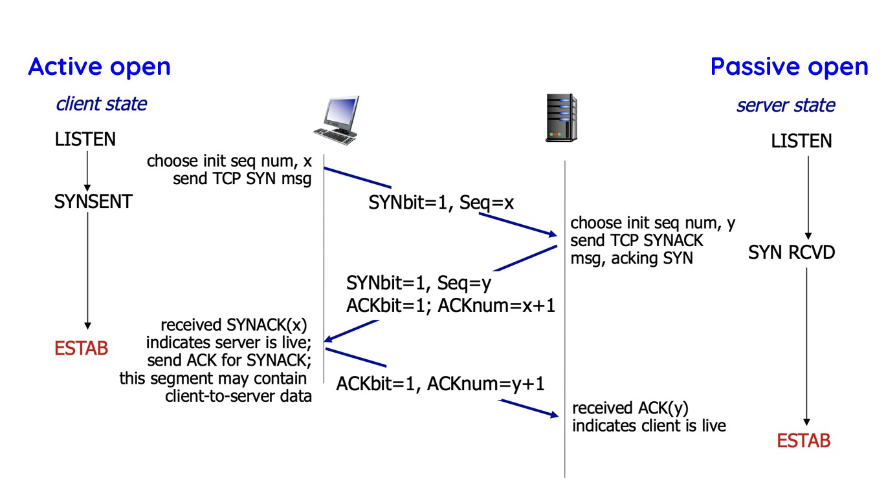

## STCP: Simple Relaible Transport Layer
- Only Implement Transport Layer
- No flow control and no retransmission
- Need to read https://web.stanford.edu/class/cs244a/hw3/hw3.html
- Also read RFC 793

### Reading Note
- there is a MYSOCK api which provides a lot of socket api:
The interface provided by this layer is the same as the socket interface with the words "my" prefixed to every function call name. You should look in the files mysock_api.c, mysock.c, and mysock.h for these functions. We have provided you with the functions: mysocket, mybind, myconnect, mylisten, myaccept, myclose, myread, mywrite corresponding to the socket interface provided by the kernel. You are not allowed to change any of these functions.

### STCP Overview
- Full Duplex:
data flows in both directions over the same connection
- Connection Oriented:
 the packets you send to the peer are in the context of some pre-existing state maintained by the transport layer on each host.
- Guarentees in-order delivery:
Ensures that, short of catastrophic network failure, data sent by one host will be delivered to its peer in the correct order

### TCP header:
- Defined in transport.h. We don't need to handle some of them
1. th_sport and th_dport represent tcp source port and tcp destination port reperately    (No need to handle)
2. th_seq and th_ack represent sequence number and acknowledge number seperately          (Need to handle)
3. th_win (Need to handle), th_sum is is windows size and checksum. One of them is used in flow_control and the other is for make sure the transmission is correct
4. th_off (need to handle), this field means where the payload starts. Since sometime the header length will change, th_off is a 4 bits field. Every bit change represent 1 words change or 32 bits length change in the header file
5. th_flags (need to handle), its related TH_FIN, TH_SYN... and other different state bits

- Sequence Numbers
1. Sequence number represents the byte sequence number at the start of the message an end wants to transform.
2. It starts with a randomly chosen sequence numver range from 0 to 255
3. Even the paload is empty, i.e. Purely ACK package, we still increase the sequenece number by one

- ACK Packet
1. ACK packet acknowledge what a reciever recieved and show the start bytes number ACK packet expected to recieve in next transfer. 

  

- Sliding Windows
The rules for managing the windows are:
1. The local receiver window has a fixed size of 3072 bytes.
2. The sender window is the minimum of the other side's advertised receiver window, and the congestion window.
3. The congestion window has a fixed size of 3072 bytes.
4. As stated in the acknowledgment section, data which is received with sequence numbers lower than the start of the receiver window generate an appropriate acknowledgment, but the data is discarded.
5. Received data which has a sequence number higher than that of the last byte of the receiver window is discarded and remains unacknowledged.
Note that received data may cross either end of the current receiver window; in this case, the data is split into two parts and each part is processed appropriately.
6. Do not send any data outside of your sender window.
The first byte of all windows is always the last acknowledged byte of data. For example, for the receiver window, if the last acknowledgment was sequence number 8192, then the receiver is willing to accept data with sequence numbers of 8192 through 11263 (=8192+3072-1), inclusive.

## Impementation Breakdown:
### Implementation of Transport Layer
1. Allocate and initialize the context: The function allocates memory for the context_t structure, which holds the connection-specific variables and state. It then generates an initial sequence number for the STCP connection.

2. Handshake and unblock the application: Based on the is_active flag, the function should perform the necessary steps to establish a connection. If is_active is true, it should send a SYN packet to initiate the handshake. If is_active is false, it should wait for a SYN packet from the remote peer. After the handshake completes successfully, the function should unblock the application using stcp_unblock_application(sd). If an error occurs during the connection setup, the function can set errno appropriately before calling stcp_unblock_application(sd) to communicate the error condition to the application.

3. Enter the control loop: The function enters the main STCP control loop by calling control_loop(sd, ctx). This loop repeatedly waits for events to occur, such as incoming data from the peer, new data from the application (via mywrite()), a socket closure request (via myclose()), or a timeout.

4. Handle events in the control loop: Inside the control loop, the function checks the type of event that occurred using stcp_wait_for_event(). Depending on the event, it performs the necessary actions:

5. If the event indicates incoming data from the application (APP_DATA), the function should handle the received data, possibly by calling stcp_app_recv() to process and deliver the data to the application.

6. Other events, such as network events or socket closure requests, should also be handled appropriately based on the STCP protocol and the desired behavior of the transport layer.

7. Cleanup and free resources: Once the loop exits (e.g., due to a socket closure request), the function should perform any necessary cleanup tasks, such as freeing allocated memory or releasing resources associated with the connection.

### Initialzation
1. we need to use three way hand shaking method here

  

2. Now we will devide peers into two catagories and introduce them one by one
- ACTIVE OPEN: 

If the peer is the active one. In other word, it needs to start transmission first, and then change its state to SYNSENT. After recieving the ACK bits, it will resend an empty handshaking and change its state to ESTAB

- PASSIVE OPEN: 

If the peer is a passive open. It means it will start to listen first. And then change to SYNRCVD once it recv the incomming message from ACTIVE PEER. Then it will send the ACK package and wait for ACK package fron ACTIVE PEER. After recv packet, it will transfer to ESTAB state.

### Connection Teardown
1. We need to use four way hand shaking here

  

2. Now we will devide peers into two catagories and introduce them one by one. 
- ACTIVE CLOSE: 

If the peer is an active one, it means the application in this peer explicitly send a close signal to this peer. Therefore, it will break its loop and send out a signal and set its FIN bit to one with corresponding seq number. Its cstate will change to FIN_WAIT_1. Then after recieve a signal from passive peer, it will change its state to FIN_WAIT_2. At this stage passive can still send data by make the flags in TCP header to ACK rather than FIN if it needs. Finally, after detecting one more FIN flags in TCP header, it will change its stage to TIMED-WAIT. After waitng for a long time, it will transfer to close stage.

- PASSIVE CLOSE: 

If the peer is a passive one , after recv a signal with TCP header contained a FIN bit, it will change its state to CLOSE_WAIT. It will also send a ACK pacage signal to ACTIVE PEER. It can still transfer more data if it wants by set FIN bit to zero. When it is ready to close the connection, it will transfer a TCP header contain a FIN bits, and change its state ti LAST_ACK. After recive an ACK bits to its FIN package, it will change its state to close

## Implememtation Details:
- strlen(NULL) will give you a segmentation error
- the length of packet in network recv shall be the length of TCP packet instead of the payload
- sequence number do not increase when we transmit purely ack packet
